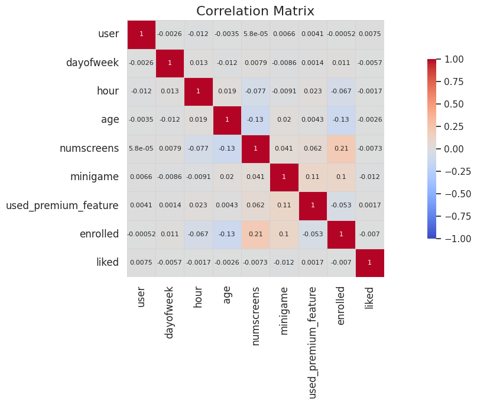

# Behavior Driven Subscriptions

Goal: Convert free users into paid members. The objective is to identify customers that are most likely not to enrol in the paid products so that additional offers can be given to them. Because of the costs of these offers, the company does not want to offer them to everybody. Especially customers who are likely to enrol anyway. Such an offer could be a limited-time discount, extension access to premium features or even some type of bundle package.

This project involved performing exploratory data analysis (EDA) on a simulated dataset of app behavior to gain insights into the relationships between variables. Key features such as "numscreens," "minigame," and "used_premium_feature" were examined for their correlation with the target variable, "enrolled." Through EDA, it was found that "numscreens" had a moderate positive correlation with enrollment, indicating that users who interacted with more screens were more likely to subscribe. Feature engineering techniques were applied to enhance the predictive power of the model, including the creation of new features based on user engagement and demographic information. By using a logistic regression model, the project aimed to predict customer subscriptions in order to leverage the insights gained and effectively target non-subscribers.

The dataset used in this project is a simulated dataset. Typically, this type of data is proprietary and specific to each company. However, the patterns and insights derived from this analysis closely resemble real-world scenarios.

## EDA

**Histograms of Numerical Features**

**Observations**

- Day of the week seems to have a very even distribution. No particular day seems to be favoroute when it comes to users installing the application.
- There is a very big dip in hour, around 8-10. Hours in this dataset, hours are in Coordinated Universal Time (UTC), which is a time standard used globally. UTC hours refer to the time expressed in hours according to the UTC time zone. It is used to denote a specific hour of the day in a standardized way that is not affected by time zone offsets or daylight saving time changes.

  For example, if it is 10:00 AM in UTC, it means it is 10 hours after midnight in the UTC time zone. 

  10 AM UTC - 8 hours = 2 AM PST.

  We see that this is very early in the morning, which makes sense why there is a dip in the number of enrolment at this hour.

- For age, we see a few jumps  around 30, 40, and 55. Most people seem to be around 20-30, and the distribution stats to tail off after 40.

**Correlation with Response**

**Observations**

- numscreens has a positive correlation of 0.209457 with the response variable. This suggests that there is a moderate positive relationship between the number of screens used by the user and their likelihood of paying for a subscription. In other words, users who interact with more screens within the app are more likely to pay for a subscription.

- minigame has a positive correlation of 0.104979 with the response variable. This indicates a smaller positive relationship between engaging in the mini-game feature and the likelihood of paying for a subscription. Users who participate in the mini-game feature might have a slightly higher tendency to subscribe.

- age has a negative correlation of -0.131303 with the response variable. This suggests a moderate negative relationship between a user's age and their likelihood of paying for a subscription. Older users might be less inclined to subscribe compared to younger users.

- used_premium_feature has a negative correlation of -0.052703 with the response variable. This implies a weak negative relationship between using the premium features and the likelihood of paying for a subscription. Users who have used the premium features might be slightly less likely to subscribe.

**Correlation Matrix: To Check for Multi-Collinearity**

**Observations**

- Overall, there are no strong correlations (absolute values close to 1.0) between any pair of variables in the dataset. This suggests that there is no severe multicollinearity issue among the variables.

## Feature Engineering

**Observations** 
- Upon further inspection, we see that this enrollment happens most within the first 10 hours.

## Results from Logistic Regression

Metrics:

| Metric    | Value   |
|-----------|---------|
| Accuracy  | 0.6839  |
| Precision | 0.7428  |
| Recall    | 0.5485  |
| F1 Score  | 0.6310  |

**Confusion Matrix**

- Accuracy: The accuracy score indicates the overall correctness of the model's predictions. An accuracy of 0.6839 means that the model correctly predicts customer subscriptions around 68.39% of the time. It suggests that the model has moderate predictive power in identifying potential subscribers.

- Precision: Precision measures the proportion of true positive predictions out of all positive predictions made by the model. A precision score of 0.7428 indicates that the model has a relatively high ability to identify true positive cases. It suggests that when the model predicts a customer will subscribe, it is accurate around 74.28% of the time.

- Recall: Recall, also known as sensitivity, represents the model's ability to identify all positive cases correctly. A recall score of 0.5485 suggests that the model captures approximately 54.85% of the actual positive cases. It indicates that there might be room for improvement in identifying more customers who are likely to subscribe.

- F1 Score: The F1 score is a balanced measure that combines precision and recall. With an F1 score of 0.6310, the model demonstrates a moderate trade-off between precision and recall. It suggests that the model achieves a reasonable balance between accurately identifying positive cases and capturing the majority of the true positive instances.

**K fold cross validation**

Applied to assess the performance and generalization ability of a model. Results:

SVM Accuracy: 0.767 (+/- 0.009)

**Model Output**

| user   | enrolled | predicted_reach |
|--------|----------|-----------------|
| 239786 | 1        | 1               |
| 279644 | 1        | 1               |
| 98290  | 0        | 0               |
| 170150 | 1        | 1               |
| 237568 | 1        | 0               |
